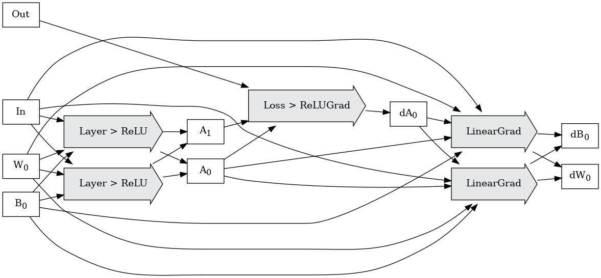

# API Design Overview

* [Table of Contents](README.md)
* [Previous](GraphRewrites.md)

Existing dataflow environments already permit massive horizontal scaling of parallel operations over
parallel collections.

For reference, see:

* [Apache Spark](https://github.com/apache/spark)
* [Apache Beam](https://beam.apache.org/)
* [Google Dataflow](https://cloud.google.com/dataflow)

These environments have several components:

* *a coordinator environment* - a traditional sequential programming environment which interacts
  with the external world, constructs operation graphs, dispatches those graphs to be executed,
  awaits their results, and potentially kicks off subsequent dependent calculations.
* *an operation environment* - constructed of idempotent parallel collections and operations which
  describes operations in a restricted embedding environment, and whose execution scheduling is
  managed by the scaling executor.

Writing applications in these environments does require additional training; while the runtime
expectations of the coordinator environments are relatively serial (construct an operation graph,
dispatch it for execution, wait for completion, observe the results and make further control flow
choices); the runtime expectations of the operation environment (hermetic, idempotent, no IO to
other systems, no iteration or batch visibility), and the semantics of the parallel collections in
the operation environment require additional training over traditional serial/local execution
environments.

However, decades of api research in this space have produced many reusable design patterns; not only
in the way to structure and debug these APIs in usable ways, but also in approaches towards
collecting them into higher-level primitives.

As we see in dataflow languages, and can expect to see here, most users, combining pre-built layers
and combinators of standard components, should not need to know or care how the underlying
covariance is described, or how the underlying kernels are scheduled.

### Dataflow Environments use Category Theory for the Win

Dataflow languages have converged on an observation about distributed scheduling; by *strictly*
restricting primitive operations, and algorithms built up from graphs of those operations, to a few
simple ideas from category theory:

* maps (functions),
* [monoids](https://en.wikipedia.org/wiki/Monoid) (reduces),
* and arrows (chained composition)

We can build arbitrarily aggressive compilation, scheduling, and execution environments which
provably produce the same results.

Each of these ideas come with a few laws about their operation behavior; and we can use embedding
proofs to prove that an algorithm whose component parts do not violate those rules, written in these
terms of these ideas, can be mechanically restructured to large number of equivalent algorithms in
different embeddings, provided that the embeddings maintain the invariants of those rules.

The transformed program is guaranteed to be equivalent to the source program:

Armed with this proof, a large family of mechanical optimizations have already been developed which
bring execution throughput and reliability of large programs to levels unreachable by
human-maintained algorithms; because the fusion results would be too complex to maintain directly;
transparent retries, operation fusion, stacked operation rewrites, local recomputation, result
caching; all in the same execution environment, *for free* from the perspective of application
developers.

Consider a hypothetical graph describing the forward and backward passes of a simple network:

Under a suitable hypothetical embedding environment, sharding with operation fusion, as seen in this
example, should be mechanically computable and provably equivalent:

Additionally, in practice, we see that these languages permit specialization of R&D streams:

* library/application developers using high-level operations to build functions, reductions, and
  graphs;
* category theory developers writing new composite high-level operations to expose functionality in
  reusable ways;
* and a (much smaller) group of system developers building and optimizing the execution / embedding
  environments.

*Particularly, advancement of research and development at the execution layer accelerates all
programs.*

## Next

* [Table of Contents](README.md)
* [Next](ExploringTensorBlockShardingFeasibility.md)
