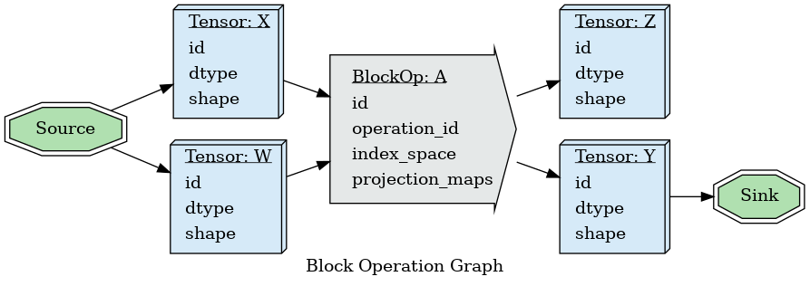
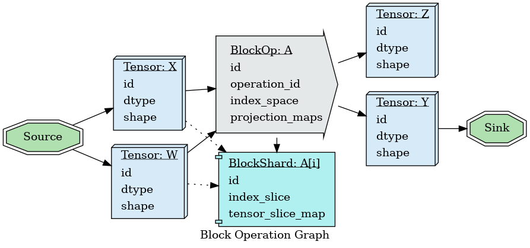
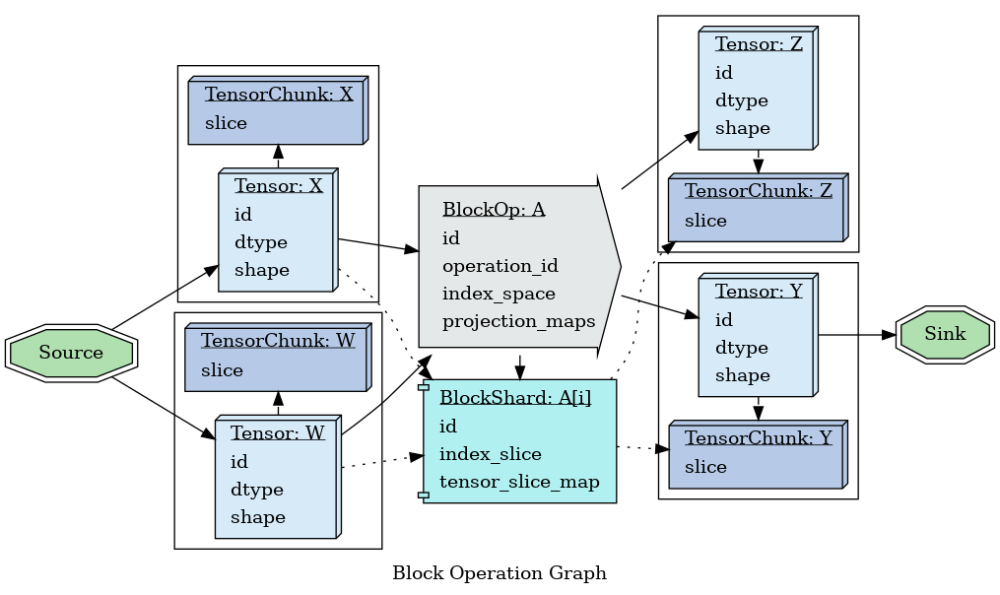
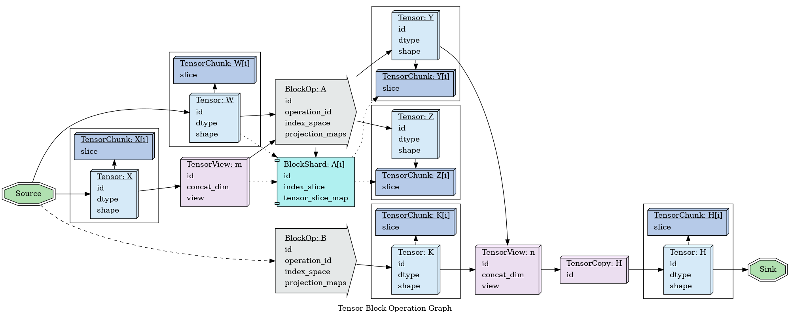

# Block Graph

* [Table of Contents](README.md)
* [Previous](IndexProjectionDesign.md)

To begin to make concrete a block operation graph, we need to collect the concepts already 
discussed.

To make it explicit, we're modeling DAGs, directed acyclic graphs; and forbidding loops.

In any operation graph, it's standard to include *Source* and *Sink* node, to distinguish the 
observation flow through the graph. Any operation or data which cannot be observed directly
through *Sink* can be re-written (via fusion, or other operations); and any node which lacks
any functional dependency path to *Sink* can be removed entirely.

At an initial level, we see:

* one *Source* node, the notional source of all external data.
* one *Sink* node, the notional observer of the execution.
* *Tensor* nodes describing tensors being operated upon.
* *BlockOp* nodes describing tensors being operated upon.

The *BlockOp* nodes refer to an *operation_id*. This is the id of the block operation in the 
planning environment; at this layer it is not important how that operation is implemented, so
an id is sufficient, but it is important (for rewrite operations) to be able to determine what
the block operation is.

When we introduce block sharding, we introduce:

* *BlockOp* nodes to describe the shard boundaries.

And when we begin to model the fact that tensors are distributed in space, we introduce:

* *TensorChunk* nodes to describe the distributed tensor slices.

*TensorChunk* nodes exist to plan coherent load/store operations; and notional external tensors,
perhaps provided by a network layer independent of the scheduled nodes, may be modeled as having
one complete *TensorChunk*, if there was no IO impact of coherent reads from them.

Recalling the rewrites we wish to do for *torch.nn.Conv* dilated kernels, there are times we
want to observe portions of a tensor without performing a copy; and there are times we wish
to efficiently concatenate the results of different block operations into one tensor, again
with minimal copy operations.

For this, we introduce:

* *TensorView* nodes, which describe the routing of concatenation of other *Tensor* or 
  *TensorView* nodes, and *stride-only* view operations (transpose, reversal, slice)
  on those tensors.

There are also situations, either for final observation, or for internal efficiency, that we'll
need to copy out a tensor view into reified storage. For this we introduce:

* *TensorCopy* nodes, to describe operations which should explicitly build a new tensor from a view.

Provided we had storage for the tensor chunks, and decomposed the *BlockOp* operations into 
*BlockShard* components such that their input, output, and intermediate data would fit in a
single worker node, and that each *TensorChunk* was produced by exactly one *BlockShard*,
we could write an (extremely inefficient) greedy scheduler which could run an arbitrary large
graph to completion:

* While there are *BlockShard*s or *TensorCopy*s observable through any path to *Sink*:
  * Pick and execute at least one of them.

It would only need to find a *BlockShard* or a *TensorCopy* who's inputs were all computed, and 
execute it, until there were no more nodes of work to complete.

## Next

* [Table of Contents](README.md)
