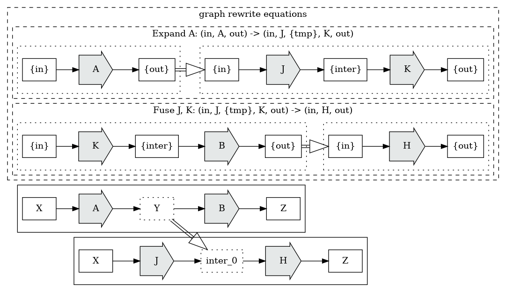

# Graph Rewrites

Graph rewrites are critical to compiler development and schedule optimization.

We are interested in mechanisms which take an input graph *G*, and produce an output graph *G'*,
re-written to achieve some goal; but generally with the constraint that the two graphs (*G* and 
*G'*) are semantically equivalent.

We can additionally define some language *L*, being the collection of node and edge types and 
properties permitted in *L*, as well as constraints on wellformed graphs in *L*.

A graph *G* _in_ *L* is constructed entirely from components legal in *L*, and satisfies any 
constraints on graph structure which *L* requires.

When discussing re-write mechanisms for language implementation, we are interested in mechanisms
which preserve semantics at each step; and which map wellformed graphs to wellformed graphs.

Given a graph *G* in *L*, we can describe abstract rewrites:

* *(G, L)* => *(G', L)*  
  Rewrites which restructure the graph, but do not change the language.
* *(G, L')* => *(G', L')*  
  Rewrites which restructure the graph, and change the language.

By maintaining wellformed properties at each rewrite step, we can apply an arbitrary number 
and depth of rewrites, and arrive at graphs which preserve the original semantics.

We are primarily interested in:

* *optimization rewrites*,
* *abstraction expansion rewrites*, and 
* *embedding rewrites*

These rewrites are all down-hill, in terms of either the cost models of the languages, or in 
terms of moving towards a goal language; deterministic single-descent application will get us 
where we need to go.

Consider the application of a simple set of re-write rules to a graph:

### Optimization Rewrites

When describing computational operations, even when we don't have a direct evaluator for a 
high-level language *L*, we generally have some abstract evaluation model over *L*, describing
an abstract cost model to compare the costs of different graphs in *L. 

*Optimization rewrites* change some portion of a graph into something which reduces that 
expected abstract cost model to a cheaper representation, while preserving semantics.

Consider extracting a common constant term:

    Sum[n](a[i] + c)

    # extract constant addition =>
    Sum[n](a[i]) + n*c

If we assume that *L* has costs to *Sum* linearly proportional to *n*, this transformation is 
always a good idea. 

### Abstraction Expansion Rewrites

It is frequently useful to define features of an extension language *L'* _in terms of_ some base 
kernel language *L*. We can add new constructs to a graph language by defining graph rewrites which
remove and replace those new constructs with existing features from the base kernel language.

Consider a language which defines *for* in terms of *while*:

    i = 0;
    for (i = 0; i < 5) foo();

    # expand "for" =>
    i = 0;
    while (i < 5) {
      foo();
      i = i + 1;
    }

By applying a *while-removing* rewrite to an input graph G, we can effectively rewrite from *L'* 
to *L*

### Embedding Rewrites

*Embedding rewrites* take a graph *G0* from a language *L0* to another graph *G1* in another 
language *L1*, replacing all nodes, edges, and values with equivalent values in *L1*.

If the gap between the semantics of *L0* and *L1* is large, it is common to introduce one (or more)
intermediate languages (*L01a*, *L01b*, etc), and to incrementally lower from *L0* to *L01a*, 
rewrite abstractions and perform optimizations in *L01a*, and then lower to *L01b*, until reaching
*L1*.

By performing *incremental lowering*, we can reduce the complexity of each step, while maintaining
high engineering confidence in the correctness of the transformations.

### De-Optimization Rewrites

There are other semantic-preserving rewrites which we could consider, but they bring a much more
complex search problem to us. Every semantic preserving rewrite application is an edge in a
meta-graph connecting all possible rewrites of an input graph; and we are interested in
minimizing the final cost of applying optimizations, expanding abstractions, and translating
languages. There are some rewrites which may be locally poor choices, increasing the abstract
cost model, but may enable further rewrites, either at this layer, or after embedding, which
reduce the total cost.

Exploration of cost minimization in the presence of *de-optimization rewrites* generally 
requires a weighted bread-first exploration of the cost model of the resolved meta-graph, 
something generally reserved for 3rd or 4th generation compilers. 

There are situations where strongly researched de-optimizations may be applied universally in
deterministic re-write passes, if they can be demonstrated to enable a useful transformation
to pay back the costs.

## Applying Rewrites

Graph rewrite systems are generally organized in stages, applied incrementally, which lower a graph 
towards the intended target language.

We see two general organizational families of rewrite stages:

* *deterministic rewrite stages*
* *non-deterministic rewrite stages*

A *deterministic rewrite* stage seeks patterns in a graph, applies rewrite rules, and completes.

A *non-deterministic rewrite* stage seeks patterns in a graph, applies rewrite rules, and 
continues until no patterns match. Consider a rewrite:

    X(a0, a1, ..., an)

    # partition =>
    Z(a0) + X(a1, ..., an)

We can define rewrites which produce the same nodes, on simpler problems, provided we're certain 
that we retain a forcing function; and drive them with a non-deterministic stage until they no 
longer apply. It is sometimes _possible_ to express the same ideas using deterministic rewrites, 
but even in those situations, the non-deterministic equations may be significantly simpler.

It is easier to think about deterministic rewrite stages, but the set of languages which a 
non-deterministic rewrite can manipulate is larger; consider optimizations which can be written 
in terms of abstractions, and abstractions which can be written in terms of other abstractions.

With non-deterministic rewrites, we'd like the general property that the rewrites constitute a 
forcing function, that applying them will eventually terminate; but establishing that property 
requires examining all rewrites in the rewrite set.

In general, where a rewrite stage can be accomplished with a deterministic rewrite, it's usually
beneficial to do so; and where a non-deterministic rewrite is required, it's usually useful to
refactor that into multiple stages such that the non-deterministic rewrite set is as small as 
possible.

