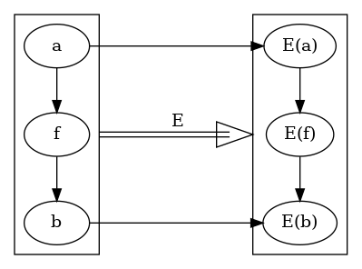
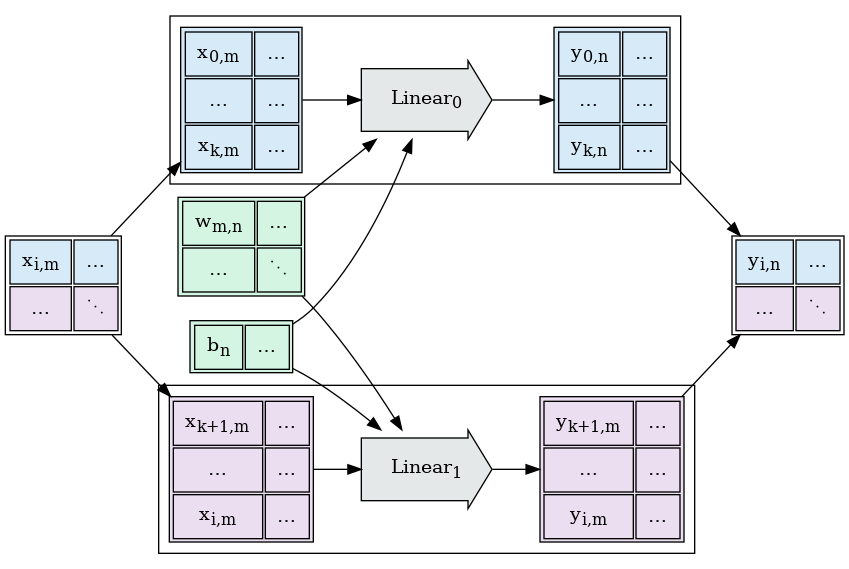
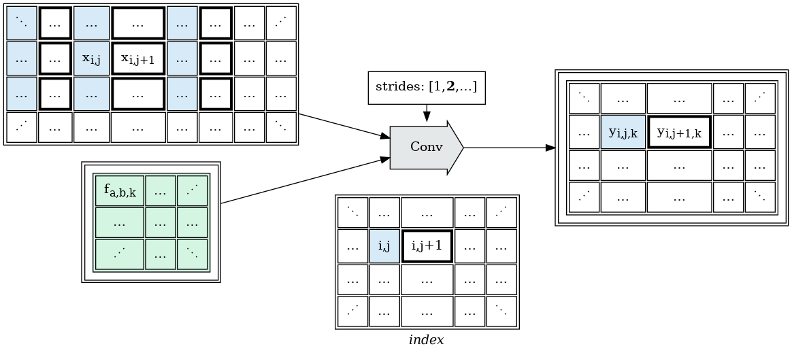
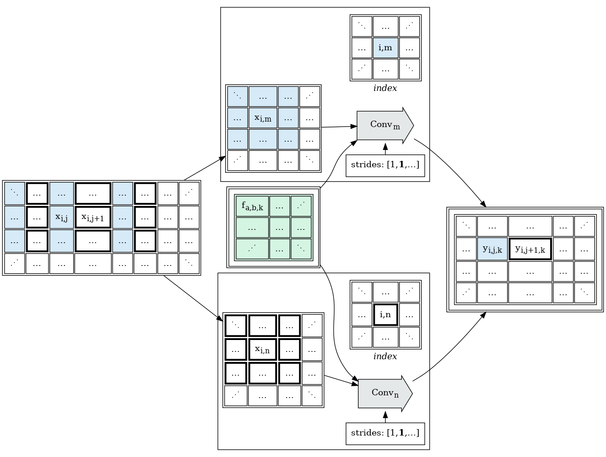

# Tapestry

crutcher@meta.com, crutcher@gmail.com

## Abstract

Tapestry is a project to prototype a rewriting and scheduling framework for dense block tensor
graph expressions; "Spark, for GPU Accelerated AI/ML Tensor Algorithms".

## Supplemental Documents

* [Graph Rewrites](GraphRewrites.md)  
  Describes the general problem of incremental lowering via graph rewriting.

## Background

There would be significant value in divorcing the development of tensor applications from the
scheduling and efficient execution of those applications. One problem requires specialized training
in statistics, machine learning, physics, or some other branch of math that cares about tensors;
the other requires specialized training in scheduling theory, distributed system engineering,
and compiler design.

Exiting dataflow environments are already
[embarrassingly parallel](https://en.wikipedia.org/wiki/Embarrassingly_parallel), able to
exploit large numbers of workers simultaneously, while computing effective function dependencies
between calculations.

Most tensor algorithms used in AI/ML are, in principle, embarrassingly parallel at the level of the
functional dependencies of individual data cells, but existing tensor algorithm expression languages
make it difficult for execution environments to exploit this property.

The challenge of functionally exploiting parallelism in tensor algorithms across machines lies in:

* expressing the parallelism opportunities to the scheduler,
* while maintaining spatial and temporal locality needed to exploit CUDA/GPU/TPU environments,
* and exposing the above in a framework which remains understandable to application developers.

A significant amount of work has been done in decorating existing AI/ML algorithms with parallelism
points, either by batching workers, or splitting layers across devices, or both; and in attempting
to determine locations that those annotations can be safely auto-inserted by sufficiently smart
compilers.

Tapestry aims to demonstrate an approach to the problem from the other side, by demonstrating
extensions to the dataflow graph execution model (Parallel Collections + Parallel Operations) which
permit fine-grained description of the covariance between tensor spatial locality and CUDA kernel
time locality in operations.

There are 4 primary components needed to demonstrate this:

* a demonstration that AI/ML algorithms can fit in dataflow languages at all,
* a demonstration of at least one working solution to space/time covariance graph description,
* a demonstration that that covariance description can be used to schedule dense operations,
* a demonstration that an api built on this can be aligned with existing AI/ML design patterns.

### Related Work

* *FAX* on *jax.pjit* \
  https://www.arxiv-vanity.com/papers/2204.06514/ \
  Appears to be pursuing similar slicing research, using *jax.pjit* as a backend.

## API Design Overview

Existing dataflow environments already permit massive horizontal scaling of parallel operations over
parallel collections.

For reference, see:

* [Apache Spark](https://github.com/apache/spark)
* [Apache Beam](https://beam.apache.org/)
* [Google Dataflow](https://cloud.google.com/dataflow)

These environments have several components:

* *a coordinator environment* - a traditional sequential programming environment which interacts
  with the external world, constructs operation graphs, dispatches those graphs to be executed,
  awaits their results, and potentially kicks off subsequent dependent calculations.
* *an operation environment* - constructed of idempotent parallel collections and operations which
  describes operations in a restricted embedding environment, and whose execution scheduling is
  managed by the scaling executor.

Writing applications in these environments does require additional training; while the runtime
expectations of the coordinator environments are relatively serial (construct an operation graph,
dispatch it for execution, wait for completion, observe the results and make further control flow
choices); the runtime expectations of the operation environment (hermetic, idempotent, no IO to
other systems, no iteration or batch visibility), and the semantics of the parallel collections in
the operation environment require additional training over traditional serial/local execution
environments.

However, decades of api research in this space have produced many reusable design patterns; not only
in the way to structure and debug these APIs in usable ways, but also in approaches towards
collecting them into higher-level primitives.

As we see in dataflow languages, and can expect to see here, most users, combining pre-built layers
and combinators of standard components, should not need to know or care how the underlying
covariance is described, or how the underlying kernels are scheduled.

### Dataflow Environments use Category Theory for the Win

Dataflow languages have converged on an observation about distributed scheduling; by *strictly*
restricting primitive operations, and algorithms built up from graphs of those operations, to a few
simple ideas from category theory:

* maps (functions),
* [monoids](https://en.wikipedia.org/wiki/Monoid) (reduces),
* and arrows (chained composition)

We can build arbitrarily aggressive compilation, scheduling, and execution environments which
provably produce the same results.

Each of these ideas come with a few laws about their operation behavior; and we can use embedding
proofs to prove that an algorithm whose component parts do not violate those rules, written in these
terms of these ideas, can be mechanically restructured to large number of equivalent algorithms in
different embeddings, provided that the embeddings maintain the invariants of those rules.

The transformed program is guaranteed to be equivalent to the source program:

Armed with this proof, a large family of mechanical optimizations have already been developed which
bring execution throughput and reliability of large programs to levels unreachable by
human-maintained algorithms; because the fusion results would be too complex to maintain directly;
transparent retries, operation fusion, stacked operation rewrites, local recomputation, result
caching; all in the same execution environment, *for free* from the perspective of application
developers.

Consider a hypothetical graph describing the forward and backward passes of a simple network:

Under a suitable hypothetical embedding environment, sharding with operation fusion, as seen in this
example, should be mechanically computable and provably equivalent:

Additionally, in practice, we see that these languages permit specialization of R&D streams:

* library/application developers using high-level operations to build functions, reductions, and
  graphs;
* category theory developers writing new composite high-level operations to expose functionality in
  reusable ways;
* and a (much smaller) group of system developers building and optimizing the execution / embedding
  environments.

*Particularly, advancement of research and development at the execution layer accelerates all
programs.*

### But Does it Blend?

CUDA/GPU/TPU execution environments are fast because they can dispatch dense operations in parallel
on vector unit hardware. A large family of kernel operations have been developed to take advantage
of that hardware, and at first glance making the argument that "Everything fits in maps, monoids,
and arrows" is not obvious.

Tapestry will attempt to demonstrate that the following common AI/ML components can be meaningfully
embedded on a framework of (map, monoid, arrow), and densely scheduled to memory and vector device:

* Activation - _trivial, this is just map_
* Convolution - _this is *also* map, but it's less obvious_
* Matmul / nn.Linear - _this is map if weights are small, and map+monoid if they are not_
* Sum, Variance - _this is monoid_

## Exploring Feasibility of Embedding nn.Linear

Consider [torch.nn.Linear](https://pytorch.org/docs/stable/generated/torch.nn.Linear.html#torch.nn.Linear)
, which can be described as operating on the tensors (X, W, B) and producing (Y):

    Y = X W + B

On a single CUDA/GPU/TPU device, we can dispatch this entire operation to a matmul kernel followed
by an addition kernel, or we can dispatch to a single specialized linear or affine transform kernel.

### Rewriting Linear over i (batch)

By examination of the *Linear* operation, we can see that rewriting into smaller operations over
the *i* (batch) dimension, and mechanically merging the results, will produce the same result:

Under fixed *W* and *B*, nn.Linear is a *map* over the *i* (*batch*) input dimension. And we can
schedule this densely,

* the map shards spatially along *i* in data resources,
* the map shards temporally along *i* in compute resources,
* the component blocks still have dense CUDA kernels for efficient dispatch of their smaller data.

### Rewriting Linear over n (nodes)

Again, by examination of the *Linear* operation, we can see that rewriting into smaller operations
over the *n* (nodes) dimension, and mechanically merging the results along a different axis, will
produce the same results.

In this case, we spatially shard both *W* and *b*, but not *X*; but we still yield a map over the *
n* (node) dimension.

* the map shards spatially along *n* in data resources,
* the map shards temporally along *n* in compute resources,
* the component blocks still have dense CUDA kernels for efficient dispatch of their smaller data.

### Defining an index space over Linear

Combining these observations over the operations in Linear, we can invent an *index* space which
corresponds to the functional dependencies of the result cells, and maps to slices of the input and
output operations:

This brings us to a property we'd like to preserve over index spaces, *coherency*:

* Any contiguous partitioning over the *index* space will be equivalent to some combination of
  rewrites over sharding by *i* and sharding by *n*, and will produce spatially coherent leaf
  operations to dispatch to CUDA/GPU/TPU kernels.

### Rewriting Linear over m (axial sum reduction)

Examining the data dependencies of *Linear*, we see we cannot rewrite over *m* and still use the
coherent leaf operation; each cell of output depends on an entire row of the *x* tensor, and an
entire column of the *w* tensor.

But if we're willing to examine the content of the leaf, we can see that:

    y(i, n) := b(n) + sum(a=[0, m-1], x(i,a) * w(a,n))
    y(i, n) := b(n) + sum(a=[0, m-1], x(i,a) * w(a,n))
    y(i, n) := b(n) + sum(a=[0, k], x(i,a) * w(a,n)) + sum(a=[k+1, m], x(i,a) * w(a,n))

If we now introduce two alternative leaf operations *matmul* and *sum*; we can rewrite this by
introducing a new accumulation dimension *k* for the sharded partial results:

This rewrite requires us to understand the relationship between alternative leaf operations, and
make that visible to the graph scheduler.

### Summarizing Linear Rewrites

At this point, we've found a number of production rules defining equivalent embeddings of *Linear*:

* *Linear* := { *Linear* }
* *Linear* := *matmul* => *sum*
* *matmul* := { *matmul* }
* *sum* := { *sum* }

Each of these transformations will produce an operation graph with different space/time costs to
evaluation; and starting with a single *Linear* operation, we can search over execution plans to
minimize that cost, without any change to the initial application's generation of that operation
graph.

## Exploring Feasibility of Embedding Conv

To explore feasibility of embedding *torch.nn.Conv*, we have to discuss coherent overlapping view
regions.

Neighboring *Conv* result cells frequently consume overlapping input data:

If we take our projection from *index* space to the data spaces for individual points in the *index*
space, and compute their overlap, rather than their union; we are still left with coherent blocks to
pass to the leaf operation. This gives us another constraint on our design:

* Coherent blocks of index projections should yield coherent overlapping blocks to input and output
  tensors.

Things become more complicated when we consider stride convolutions, where neighboring cells may not
consume the same data:

Naively, our input regions are now non-coherent; and we have a design choice in this situation.

* Compute the overlapping region, which reduces data sharing between operations; or
* Pre-Slice the input tensors into strided tensors, rewrite the strides and index space provided to
  the leaf kernels.

Consider:

This transformation has the same computational leaf cost; but permits us to recover dense neighbor
data sharing of strided conv operations; which can be useful in achieving more efficient tensor
network transmission and node memory utilization.

## Exploring Feasibility of Embedding Sum (Reduce Operations)

There's a family of operations which need to perform reductions along an entire axis.

* sum, avg
* product
* stddev, variance

Many reduction operations can be modeled as [monoids](https://en.wikipedia.org/wiki/Monoid).

To generically model as a reducible monoid, we need 4 things:

* a way to put a thing into the monoid:
    * `wrap(x) -> M[x]`
* an associative way to merge two things in the monoid:
    * `M[a] • M[b] -> M[c]`
    * `M[b] • M[a] -> M[c]`
* a zero element, that can be merged with any element as an identity:
    * `M[0] • M[a] -> M[a]`
* a way to remove things from the monoid:
    * `unwrap(M[x]) -> x`

For many operations (`sum`, `product`), `wrap()` and `unwrap()` can just be identity; the monoid
representation is the same as the input and output representation.

Other operations may require global information to complete, so their reduction representation
may be more complex. Consider `stddev`:

    @dataclass
    class PartialStats:
      n: int
      sum: float
      sum_of_squares: float

    def zero():
      return PartialStats(n=0, sum=0.0, sum_of_squares=0.0)

    def op(a, b):
      # We might even consider rescaling values to prevent overflow here.
      return PartialStats(
        n = a.n + b.n,
        sum = a.sum + b.sum,
        sum_of_squares = a.sum_of_squares + b.sum_of_squares,
      )

    def wrap(x):
      return PartialStats(n=1, sum=x, sum_of_squares=x*x)

    def wrap_all(xs):
      # equivalent to reduce(op, [wrap(x) for x in xs] + [zero()])
      return PartialStats(
        n=len(xs),
        sum=sum(xs),
        sum_of_squares=sum(x**2 for x in xs),
      )

    def unwrap_stddev(p):
      # beyond the scope of the current example, but we could just as easily
      # return several stats at once:
      #   (len, sum, avg, stddev)
      return math.sqrt((p.sum_of_squares/p.n) - (p.sum/p.n) ** 2)

We might even consider rewriting the scale (*n*) during merge to prevent value overflow.

If we've got a monoidic representation of an expression; we can rewrite arbitrarily long reductions
as a tree of smaller reductions and be certain we'll produce the same result.

In graph scheduling, we can turn an *N*-scale problem into a `log_b(N)` scale problem. If we work
with leaf operations which can perform more than one merge at a time, *b* can be quite large,
and the resulting tree graph can be very shallow.

If we know that an operation has monoid characteristics on a given axis, we show that we can rewrite
nodes into *log_b(N)* reduction layers:

## Exploring Feasibility of Embedding Tensor Generators (Random Numbers)

There's a case that's worth talking about, that breaks our existing models, but is extremely common;
random number generators:

    Y = X * 0.25 * rand_like(X)

Random number generators naively appear to violate our *map* assumptions; if we're concerned about
producing idempotent results, we have to generate the same values each time; but they're stateful
between cells, so slicing work units introduces a state management problem.

This is only a concern if we care that:

* nodes can be perfectly re-computed, and
* any slicing of the index space will produce the *same* random numbers.

Which in turn are properties to preserve primarily if:

* re-executing the tree, under any execution schedule, should yield the same result.

With numerical instability of floating point operations, this is a hard target to pursue;
different reduction orders or block slicing could yield different results; but it's a good
target to keep in mind while designing applications, as there are some where bit-identical
results are highly valued.

Any useful model of tensor operations will need a solution to embedding tensor generators which
remain stable under sharding.

If, at an api level, we can say "this is a random tensor, from this distribution, with this shape",
and take indexed slices of that space, the *how* of the tensor's generation becomes opaque to the
leaf computation, it's just another input.

If we can provide, to a generator, the original index of a sampled tensor space, and the seed
the tensor is being sampled at (and whatever static parameters the generator takes); we can
generate stable results for each view block.

    seed = 345
    sample_shape = [7, 8, 9]
    sample_point = [3, 1, 5]

    r = g(seed, sample_point)

One potential (horribly slow) implementation would be:

    gen = generator(seed)
    idx = (sample_point * sample_shape).sum()
    gen.skip(idx)

    r = gen.next()

This is a lot of wasted work, but is easy to define and stable, and works with most random number
generators.

We could potentially save some computation by examination of the selected region, and construction
of coherent runs on the original index space.

Alternatively, we could look for one-shot generators, which took the whole key as a seed input,
and yielded one-shot values with appropriate statistical properties.

Consider this paper on parallel random number generators, which may provide closed-form answers:

* http://www.thesalmons.org/john/random123/papers/random123sc11.pdf

We'll need a solution to this problem space.

## Summarizing Rewrites Observations

Even under index space projection restrictions, we appear to be able to rewrite a large family
of operations:

* region mappings and matmuls (inc: Linear, Conv, ReLU)
* reductions (inc: Sum, Stddev, Avg)

This collection of operations *appears* sufficient to embed most AI/ML applications; so we we
can pivot:

* from asking "are these operations embeddable?"
* to "how do we represent index projections?":

Examining the abstract embeddings considered thus far, we can make a number of observations about
graph components needed.

* Tensor Transpose/Slice/Merge Nodes
    * Leaf operations consume and produce *slices* of their input and output tensor spaces;
      and rewrites of the leaf operations are accompanied by rewrites of their index spaces,
      but also the slices they operate on. It will be necessary to expose slice operations
      at the graph transformation layer.
* Index Projection Functions
    * Projection from leaf index spaces to tensor block regions requires some projection/slice
      function to specify operation regions. A few properties we know we'll need:
        * Coherent projections - as the leaf operations are block operations, projections to
          neighboring cells in index space should yield coherent/contiguous selections in the target
          tensors.
        * Transformable - there are rewrites we'd like to be able to describe deterministically
          which
          alter the index projection of the rewritten nodes; so it's valuable if we can transform
          those projection functions under rewrites.
        * overlapping input projections - as we wish to model convolutions, our projection
          machinery,
          and concept of "coherent" should model overlapping neighbor selection regions.
        * non-overlapping, coherent outputs - for *output* tensors, we'd like to be able to assert
          that projections don't produce overlapping regions, and fully fill a target space.
* Tensor Generators
    * Some stable solution to rand will be needed.

Tensor transposition and slicing is extensively described; it's easy to reuse existing machinery
to describe transformations to map one set of tensor indexes to another; our primary goal is to
be able to analyze and re-write those transformations. If we are only interested in
subdividing work, then we can always append further transpose/slice operations on existing view
stacks.

So we can model tensor view operations as index mapping stacks, each producing a "new" tensor,
where the intermediate tensors may never be reified.

Index projection is a more complicated case, we're not building 1:1 mapping between cell index
locations, but describing regions, and we need a mechanic which permits this, we need a
mechanism to check that this projection is valid (to prevent bad operations in the graph, and
guard against bad re-writes), and we need a way to rewrite it.

## Index Projection Functions

In seeking index projection functions, we need to establish a mapping from every point in the
abstract index space for an operation, to some coherent region in an associated input or output
tensor.

Two notable points:

* The coherent region comes from the design constrant that neighoring points in index space should
  map to coherent blocks of the associated tensors.

* We'll further restrict selection to cubic regions: points, rectangles, blocks, etc.

* We'll further assume that the selected regions are not empty; our projection need not generate
  regions with zero (or negative) contained cells.

* We'll additionally require that all projections for the same function produce regions of the
  same shape; we're targeting block operations anyway.

* To further simplify this problem, we'll make the assumption that the index projection will not
  change any aspect of the tensor's stride: dimensionality, dimension ordering, and dimension
  direction will not change under projection. We're just selecting a region in an existing layout.

To define a coherent, non-empty cubic region of constant shape in an integer coordinate system,
we could:

* Specify an inclusive (the point is inside the region) *start* and an exclusive (the point is
  outside the region) *end* point.
* Specify an inclusive *start* and an inclusive *end* point.
* Specify an inclusive *start* and a shape.
* Specify all of the corners of the region.
* etc ...

Each of these representations is equivalent, but Projecting to a dynamic *start* point, with a
fixed *shape* is simpler to specify, and does not require the well-formedness checks of the
other mechanics, so we'll use (*start*, *shape*) to describe the output of a projection.

To map a point in one integer coordinate space to a point in another integer coordinate space,
an integer affine transform is a good place to start.

Let's consider an index projection composed of:

* *projection* - an integer projection matrix
* *offset* - an integer offset vector (it moves the *start* location)
* *shape* - an integer region shape

Let's call this approach ZProjection; is this sufficient?

### Exploring ZProjections: Fixed Tensor Inputs

For a number of operations explored above (*nn.Linear*, *nn.Conv*), while we sharded along
the dimensions of some tensors, others were consumed in full, not varying at different points
in index space.

We can use a ZProjection to project to fixed views using by:

* setting the *projection* to a zero matrix,
* the *offset* to the origin of the view,
* and the *shape* to the shape of the view.

As a result, all points in index space will map to the same fixed input view.

We can also trivially select a sub-region of the original tensor for fixed reads,
by adjusting *offset* and *shape*:

### Exploring ZProjections: nn.Linear Strides

*nn.Linear* and *matmul* stride one-at-a-time along their input and output tensors, the
shape of the selected regions is generally a one vector.

* setting the *projection* to map adjacent cells,
* the *offset* to a zero vector,
* and the *shape* to a one vector.

Again, we have a stable stride.

### Exploring ZProjections: negative nn.Linear Strides

Given that we're working with projections, there's no particular reason we can't define
a projection which counts *backwards* as index space increments.

However, when we consider dense blocks, and what it means for them to be coherent;
it is important to consider that a *subsequent* block along some dimension may
map to a *preceding* location in the target coordinate space.

### Exploring ZProjections: axial reduce (nn.Sum)

Reducing all the values along a given dimension can be accomplished by:

* setting *projection* to map the first cell in that dimension,
* setting *offset* to a zero vector,
* and *shape* to the shape of that axial row (all ones, except for one dimension matching
  the length).

### Exploring ZProjections: nn.Conv Kernel Window Strides

*nn.Conv* and convolution algorithms generally need to describe a kernel window region
centered upon some notional location.

We can start defining windows by:

* setting *projection* to map the "center" cell in the region,
* setting *offset* to adjust the location of the *start* cell,
* and *shape* to the shape of the selected region.

Our first mapped point produces a kernel which crosses the bounds of the space;
and we can see we'll see similar bounds crossing along all borders of the space
with this offset design; so we have to address the question:

* How we handle out-of-bounds indexes?

We could:

* forbid out-of-bounds indexes,
* treat index space as toroidal (it wraps around),
* treat negative indexes whose absolute value is less than the dimension as counting
  "backwards" from the end (this is what *numpy* does),
* treat the infinite space "around" our tensor as some form of pad-space
  (and define an approach to handling padding).

#### Offset is composite: projection offset + relative start offset

There's an additional problem with using *offset* to describe windows walking over
negative projection dimensions; which is that we're using *offset* to describe two things:

* the relative location of the start point from the mapped point,
* the bounds adjustment needed for negative indexing.

This has no impact when computing projections, but may affect authoring them (working in terms
of relative offsets may be easier), and in mechanically computing stride order changes (the
relative start would need to be recovered before reversing a negative dimension).

TODO: diagram
